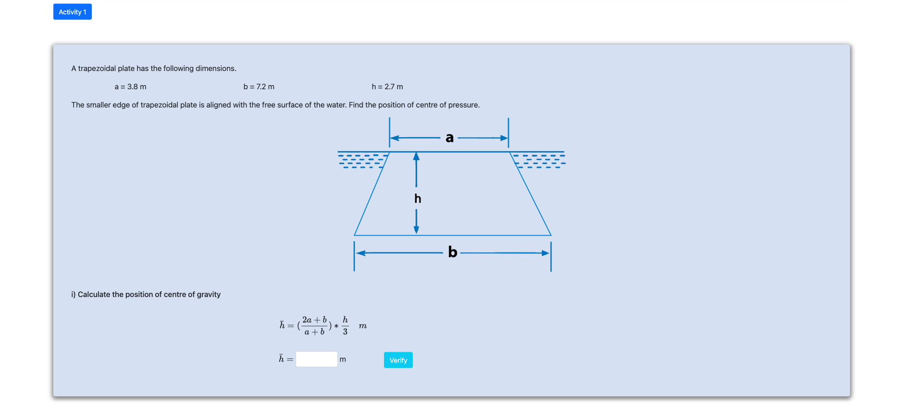

<h2>Follow the below steps to perform the experiment on the simulator</h2>
 

Step 1 : Click next to start.

Step 2 : Calculate position of center of gravity

Step 3 : Calculate hA

Step 4 : Calculate total pressure force

Step 5 : Calculate moment of inertia about center of gravity

Step 6 : Calculate position of centre of pressure 

